# Diagramme de Cas d'Utilisation - Système GTA

## Format PlantUML

Le fichier contient un diagramme PlantUML qui peut être visualisé avec :
- Extension PlantUML pour Visual Studio Code
- Outil en ligne : http://www.plantuml.com/plantuml/
- Extension pour IntelliJ IDEA / WebStorm

## Format Mermaid (Alternative)

```mermaid
graph TB
    subgraph "Acteurs"
        ADMIN[Administrateur]
        MANAGER[Manager]
        EMPLOYEE[Employé]
        SYSTEM[Système]
    end

    subgraph "Authentification"
        UC1[UC1: Se connecter]
        UC2[UC2: Se déconnecter]
        UC3[UC3: S'enregistrer]
    end

    subgraph "Gestion Employés"
        UC5[UC5: Créer employé]
        UC6[UC6: Modifier employé]
        UC7[UC7: Supprimer employé]
        UC8[UC8: Consulter liste employés]
        UC9[UC9: Consulter détails employé]
        UC10[UC10: Importer employés CSV]
    end

    subgraph "Unités Organisationnelles"
        UC11[UC11: Créer unité]
        UC12[UC12: Modifier unité]
        UC13[UC13: Supprimer unité]
        UC14[UC14: Consulter arbre]
        UC15[UC15: Consulter liste unités]
    end

    subgraph "Cycles de Travail"
        UC16[UC16: Créer cycle]
        UC17[UC17: Modifier cycle]
        UC18[UC18: Supprimer cycle]
        UC19[UC19: Consulter cycles]
        UC20[UC20: Assigner cycle]
    end

    subgraph "Horaires"
        UC21[UC21: Créer horaire]
        UC22[UC22: Modifier horaire]
        UC23[UC23: Supprimer horaire]
        UC24[UC24: Consulter horaires]
        UC25[UC25: Gérer périodes]
        UC26[UC26: Gérer plages horaires]
        UC27[UC27: Assigner horaire]
    end

    subgraph "Pointages"
        UC28[UC28: Pointer entrée]
        UC29[UC29: Pointer sortie]
        UC30[UC30: Consulter ses pointages]
        UC31[UC31: Consulter tous pointages]
        UC32[UC32: Calculer heures auto]
        UC33[UC33: Consulter balance]
    end

    subgraph "Validation"
        UC34[UC34: Valider pointage]
        UC35[UC35: Valider période]
        UC36[UC36: Stats validation]
        UC37[UC37: Règles validation]
    end

    subgraph "Absences"
        UC38[UC38: Demander absence]
        UC39[UC39: Modifier absence]
        UC40[UC40: Consulter ses absences]
        UC41[UC41: Consulter toutes absences]
        UC42[UC42: Approuver/Rejeter absence]
    end

    subgraph "Heures Supplémentaires"
        UC43[UC43: Créer heures sup]
        UC44[UC44: Consulter ses heures sup]
        UC45[UC45: Consulter toutes heures sup]
        UC46[UC46: Approuver heures sup]
    end

    subgraph "Heures Spéciales"
        UC47[UC47: Créer heures spéciales]
        UC48[UC48: Consulter ses heures spéciales]
        UC49[UC49: Consulter toutes heures spéciales]
        UC50[UC50: Approuver heures spéciales]
    end

    subgraph "Notifications"
        UC51[UC51: Consulter notifications]
        UC52[UC52: Marquer comme lue]
        UC53[UC53: Marquer toutes lues]
        UC54[UC54: Supprimer notification]
        UC55[UC55: Envoyer notification]
    end

    subgraph "Rapports"
        UC56[UC56: Rapport général]
        UC57[UC57: Rapport par employé]
        UC58[UC58: Rapport mensuel]
        UC59[UC59: Rapport présence]
        UC60[UC60: Rapport heures sup]
        UC61[UC61: Exporter rapport]
    end

    subgraph "Fiches de Paie"
        UC62[UC62: Consulter fiche de paie]
        UC63[UC63: Imprimer fiche de paie]
        UC64[UC64: Filtrer par période]
    end

    subgraph "Audit"
        UC65[UC65: Consulter logs audit]
        UC66[UC66: Logs par modèle]
        UC67[UC67: Logs par utilisateur]
    end

    subgraph "Dashboard"
        UC68[UC68: Consulter dashboard]
        UC69[UC69: Consulter statistiques]
    end

    %% Relations ADMIN
    ADMIN --> UC1
    ADMIN --> UC2
    ADMIN --> UC3
    ADMIN --> UC5
    ADMIN --> UC6
    ADMIN --> UC7
    ADMIN --> UC8
    ADMIN --> UC9
    ADMIN --> UC10
    ADMIN --> UC11
    ADMIN --> UC12
    ADMIN --> UC13
    ADMIN --> UC14
    ADMIN --> UC15
    ADMIN --> UC16
    ADMIN --> UC17
    ADMIN --> UC18
    ADMIN --> UC19
    ADMIN --> UC20
    ADMIN --> UC21
    ADMIN --> UC22
    ADMIN --> UC23
    ADMIN --> UC24
    ADMIN --> UC25
    ADMIN --> UC26
    ADMIN --> UC27
    ADMIN --> UC31
    ADMIN --> UC34
    ADMIN --> UC35
    ADMIN --> UC36
    ADMIN --> UC37
    ADMIN --> UC41
    ADMIN --> UC42
    ADMIN --> UC43
    ADMIN --> UC45
    ADMIN --> UC46
    ADMIN --> UC47
    ADMIN --> UC49
    ADMIN --> UC50
    ADMIN --> UC51
    ADMIN --> UC55
    ADMIN --> UC56
    ADMIN --> UC57
    ADMIN --> UC58
    ADMIN --> UC59
    ADMIN --> UC60
    ADMIN --> UC61
    ADMIN --> UC62
    ADMIN --> UC63
    ADMIN --> UC64
    ADMIN --> UC65
    ADMIN --> UC66
    ADMIN --> UC67
    ADMIN --> UC68
    ADMIN --> UC69

    %% Relations MANAGER
    MANAGER --> UC1
    MANAGER --> UC2
    MANAGER --> UC6
    MANAGER --> UC8
    MANAGER --> UC9
    MANAGER --> UC15
    MANAGER --> UC19
    MANAGER --> UC24
    MANAGER --> UC31
    MANAGER --> UC34
    MANAGER --> UC35
    MANAGER --> UC36
    MANAGER --> UC37
    MANAGER --> UC41
    MANAGER --> UC42
    MANAGER --> UC43
    MANAGER --> UC45
    MANAGER --> UC46
    MANAGER --> UC47
    MANAGER --> UC49
    MANAGER --> UC50
    MANAGER --> UC51
    MANAGER --> UC56
    MANAGER --> UC57
    MANAGER --> UC58
    MANAGER --> UC59
    MANAGER --> UC60
    MANAGER --> UC61
    MANAGER --> UC62
    MANAGER --> UC63
    MANAGER --> UC68
    MANAGER --> UC69

    %% Relations EMPLOYEE
    EMPLOYEE --> UC1
    EMPLOYEE --> UC2
    EMPLOYEE --> UC28
    EMPLOYEE --> UC29
    EMPLOYEE --> UC30
    EMPLOYEE --> UC33
    EMPLOYEE --> UC38
    EMPLOYEE --> UC39
    EMPLOYEE --> UC40
    EMPLOYEE --> UC44
    EMPLOYEE --> UC48
    EMPLOYEE --> UC51
    EMPLOYEE --> UC52
    EMPLOYEE --> UC53
    EMPLOYEE --> UC54
    EMPLOYEE --> UC62
    EMPLOYEE --> UC63
    EMPLOYEE --> UC64
    EMPLOYEE --> UC68

    %% Relations SYSTEM
    SYSTEM --> UC32
    SYSTEM --> UC55

    %% Relations d'inclusion
    UC28 -.->|include| UC32
    UC29 -.->|include| UC32
    UC32 -.->|include| UC43
    UC32 -.->|include| UC47
    UC62 -.->|include| UC64
    UC63 -.->|include| UC62
```

## Description des Cas d'Utilisation

### Authentification

#### UC1: Se connecter
**Acteur principal** : Tous les utilisateurs  
**Préconditions** : Aucune  
**Scénario principal** :
1. L'utilisateur accède à la page de connexion
2. Il saisit son email et mot de passe
3. Le système valide les identifiants
4. Le système génère un JWT token
5. L'utilisateur est redirigé vers le dashboard

**Scénario alternatif** :
- 3a. Identifiants incorrects → Message d'erreur affiché

#### UC2: Se déconnecter
**Acteur principal** : Tous les utilisateurs  
**Préconditions** : Utilisateur connecté  
**Scénario principal** :
1. L'utilisateur clique sur "Déconnexion"
2. Le token est supprimé du localStorage
3. L'utilisateur est redirigé vers la page de connexion

#### UC3: S'enregistrer
**Acteur principal** : Administrateur  
**Préconditions** : Aucune  
**Scénario principal** :
1. L'administrateur accède à la page d'enregistrement
2. Il saisit l'email et le mot de passe
3. Le système crée le compte
4. Le système redirige vers la page de connexion

### Gestion des Employés

#### UC5: Créer un employé
**Acteur principal** : Administrateur  
**Préconditions** : Administrateur connecté  
**Scénario principal** :
1. L'administrateur accède à la page "Employés"
2. Il clique sur "Ajouter un employé"
3. Il remplit le formulaire (matricule, nom, prénom, etc.)
4. Il sélectionne l'unité organisationnelle et le cycle de travail
5. Il valide le formulaire
6. Le système crée l'employé
7. Un log d'audit est créé

#### UC6: Modifier un employé
**Acteur principal** : Administrateur, Manager  
**Préconditions** : Employé existant  
**Scénario principal** :
1. L'utilisateur accède à la liste des employés
2. Il clique sur "Modifier" pour un employé
3. Il modifie les informations souhaitées
4. Il valide les modifications
5. Le système met à jour l'employé
6. Un log d'audit est créé

#### UC10: Importer des employés (CSV)
**Acteur principal** : Administrateur  
**Préconditions** : Fichier CSV valide  
**Scénario principal** :
1. L'administrateur accède à la page "Employés"
2. Il clique sur "Importer CSV"
3. Il sélectionne le fichier CSV
4. Le système parse le fichier
5. Le système crée les employés valides
6. Le système affiche le résultat (créés/ignorés)

### Pointages

#### UC28: Pointer l'entrée
**Acteur principal** : Employé  
**Préconditions** : Employé connecté, pas de pointage en cours  
**Scénario principal** :
1. L'employé accède à la page de pointage
2. Il clique sur "Pointer l'entrée"
3. Le système enregistre l'heure d'entrée
4. Le système crée un pointage en statut PENDING

#### UC29: Pointer la sortie
**Acteur principal** : Employé  
**Préconditions** : Pointage d'entrée existant  
**Scénario principal** :
1. L'employé accède à la page de pointage
2. Il clique sur "Pointer la sortie"
3. Le système enregistre l'heure de sortie
4. Le système calcule automatiquement les heures travaillées
5. Le système crée les heures supplémentaires/spéciales si nécessaire
6. Le pointage passe en statut COMPLETED

**Note** : Ce cas d'utilisation inclut automatiquement UC32 (Calculer les heures)

#### UC32: Calculer automatiquement les heures
**Acteur principal** : Système  
**Préconditions** : Pointage d'entrée et sortie  
**Scénario principal** :
1. Le système récupère le cycle de travail de l'employé
2. Le système récupère l'horaire correspondant au jour
3. Le système décompose les heures par plages horaires
4. Le système calcule les heures normales, supplémentaires et spéciales
5. Le système crée les enregistrements Overtime et SpecialHour si nécessaire

### Fiches de Paie

#### UC62: Consulter la fiche de paie
**Acteur principal** : Tous les utilisateurs  
**Préconditions** : Employé existant  
**Scénario principal** :
1. L'utilisateur accède à la liste des employés
2. Il clique sur "Imprimer" pour un employé
3. Il sélectionne une période (début/fin)
4. Le système charge les données de la période
5. Le système affiche la fiche de paie avec :
   - Informations de l'employé
   - Pointages détaillés
   - Heures supplémentaires
   - Heures spéciales
   - Absences
   - Résumé de la période

#### UC63: Imprimer la fiche de paie
**Acteur principal** : Tous les utilisateurs  
**Préconditions** : Fiche de paie chargée  
**Scénario principal** :
1. L'utilisateur clique sur "Imprimer"
2. Le système ouvre une fenêtre d'impression formatée
3. L'utilisateur configure l'impression
4. L'utilisateur imprime la fiche

### Validation

#### UC34: Valider un pointage
**Acteur principal** : Administrateur, Manager  
**Préconditions** : Pointage existant  
**Scénario principal** :
1. L'utilisateur accède à la page de validation
2. Il sélectionne un pointage
3. Il clique sur "Valider"
4. Le système valide le pointage
5. Le système envoie une notification à l'employé
6. Un log d'audit est créé

### Absences

#### UC38: Demander une absence
**Acteur principal** : Employé  
**Préconditions** : Employé connecté  
**Scénario principal** :
1. L'employé accède à la page "Absences"
2. Il clique sur "Nouvelle absence"
3. Il remplit le formulaire (type, dates, raison)
4. Il valide la demande
5. Le système crée l'absence en statut PENDING
6. Le système envoie une notification aux managers

#### UC42: Approuver/Rejeter une absence
**Acteur principal** : Administrateur, Manager  
**Préconditions** : Demande d'absence en attente  
**Scénario principal** :
1. L'utilisateur accède à la page des absences
2. Il sélectionne une demande en attente
3. Il clique sur "Approuver" ou "Rejeter"
4. Le système met à jour le statut
5. Le système envoie une notification à l'employé
6. Un log d'audit est créé

### Heures Supplémentaires

#### UC43: Créer des heures supplémentaires
**Acteur principal** : Système (automatique), Administrateur, Manager  
**Préconditions** : Pointage ou demande manuelle  
**Scénario principal** :
1. Après un pointage de sortie, le système calcule les heures sup
2. OU un admin/manager crée manuellement une demande
3. Le système crée l'enregistrement Overtime
4. Le système met le statut à PENDING si création manuelle

#### UC46: Approuver/Rejeter des heures supplémentaires
**Acteur principal** : Administrateur, Manager  
**Préconditions** : Heures supplémentaires en attente  
**Scénario principal** :
1. L'utilisateur accède à la page "Heures Supplémentaires"
2. Il sélectionne une demande en attente
3. Il clique sur "Approuver" ou "Rejeter"
4. Le système met à jour le statut
5. Le système envoie une notification à l'employé
6. Un log d'audit est créé

### Rapports

#### UC56: Générer un rapport général
**Acteur principal** : Administrateur, Manager  
**Préconditions** : Aucune  
**Scénario principal** :
1. L'utilisateur accède à la page "Rapports"
2. Il sélectionne "Rapport général"
3. Il choisit les filtres (période, unité, etc.)
4. Le système génère le rapport
5. Le système affiche les statistiques

#### UC61: Exporter un rapport
**Acteur principal** : Administrateur, Manager  
**Préconditions** : Rapport généré  
**Scénario principal** :
1. L'utilisateur clique sur "Exporter"
2. Il choisit le format (CSV ou Excel)
3. Le système génère le fichier
4. Le système télécharge le fichier

### Audit

#### UC65: Consulter les logs d'audit
**Acteur principal** : Administrateur  
**Préconditions** : Aucune  
**Scénario principal** :
1. L'administrateur accède à la page "Audit"
2. Le système affiche la liste des actions
3. L'administrateur peut filtrer par date, utilisateur, type d'action
4. Le système affiche les détails de chaque action

## Matrice des Permissions

| Cas d'Utilisation | Admin | Manager | Employee |
|-------------------|-------|---------|----------|
| Créer employé | ✅ | ❌ | ❌ |
| Modifier employé | ✅ | ✅ | ❌ |
| Supprimer employé | ✅ | ❌ | ❌ |
| Pointer entrée/sortie | ✅ | ✅ | ✅ |
| Valider pointage | ✅ | ✅ | ❌ |
| Approuver absence | ✅ | ✅ | ❌ |
| Approuver heures sup | ✅ | ✅ | ❌ |
| Consulter fiche de paie | ✅ | ✅ | ✅ (ses propres fiches) |
| Générer rapports | ✅ | ✅ | ❌ |
| Consulter logs audit | ✅ | ❌ | ❌ |

## Légende

- **✅** : Accès autorisé
- **❌** : Accès refusé
- **<<include>>** : Relation d'inclusion (le cas d'utilisation inclut un autre)
- **<<extend>>** : Relation d'extension (cas d'utilisation optionnel)

## Notes Techniques

- Les cas d'utilisation marqués "Système" sont automatiques
- Les relations d'inclusion signifient qu'un cas d'utilisation nécessite un autre
- Les relations d'extension signifient qu'un cas d'utilisation peut être étendu par un autre
- Tous les cas d'utilisation nécessitent une authentification (sauf UC1 et UC3)
